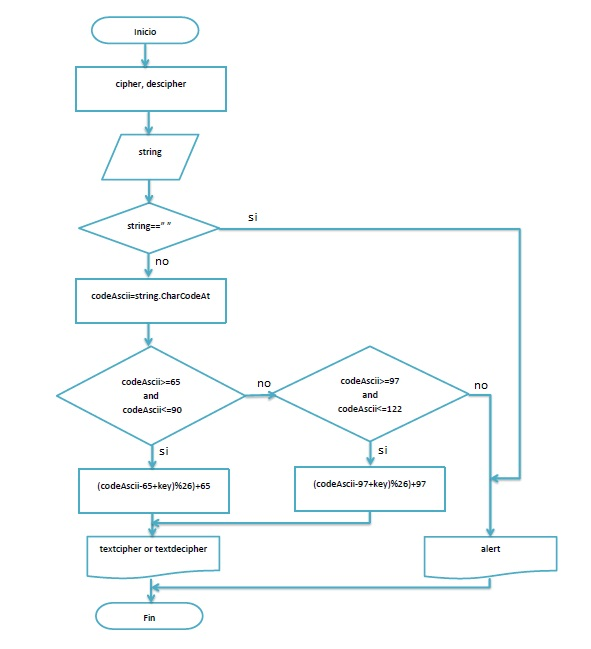

# Ejercicio: Cipher-Decipher

Descripción: Crea una web que pida, por medio de un prompt(), una frase al usuario y devuelva el mismo mensaje cifrado según el algoritmo de Cifrado César con el parámetro de desplazamiento de 33 espacios hacia la derecha.

Consideraciones Específicas:
    1.Tu programa debe ser capaz de cifrar y descifrar tanto letras mayúsculas como minúsculas. La fórmula para descifrar es: (x - n) % 26
    2.Tu código debe estar compuesto por 2 funciones con los siguientes nombres: cipher y decipher
    3.El usuario no debe poder ingresar un campo vacío o que contenga números

## Pseudocódigo

...

1. Pedir datos de entrada para enviarlos a la función cipher o descipher.
2. Si el campo del mensaje esta vacío o contiene números, enviar mensaje de alerta.
3. Obtener el valor en código ASCII de cada una de las letras del mensaje.
4. Si el valor del código ASCII se encuentra entre 65 y 90 o 97 y 122,
   4.1. Aplicar la formula de Cifrado César (x - n) % 26 o descifrado (x + n) % 26.
   4.2. De lo contrario, enviar mensaje de alerta.
5. Obtener la letra correspondiente en código ASCII.
6. Construir mensaje cifrado o descifrado.
7. Mostrar texto cifrado o descifrado.

...

## Diagrama de Flujo

A continuación se incluye el diagrama de flujo.

